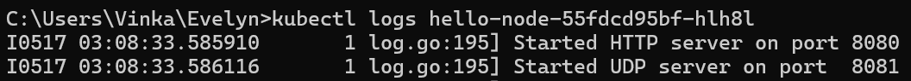
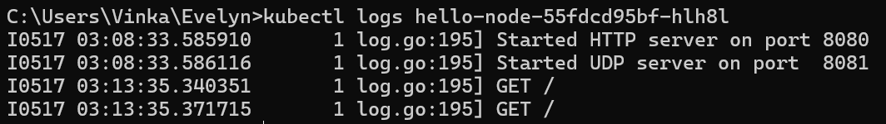
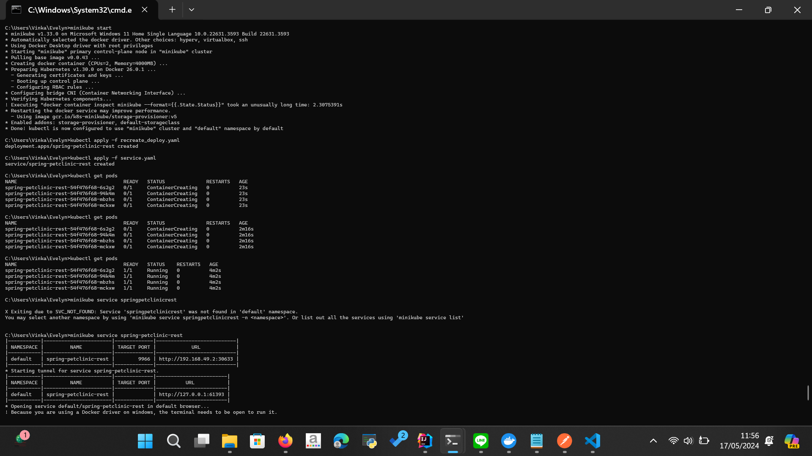

# Tutorial 11

### Reflection 1: Hello Minikube

1. Compare the application logs before and after you exposed it as a Service.
Try to open the app several times while the proxy into the Service is running.
What do you see in the logs? Does the number of logs increase each time you open the app?

Sebelum diexpose sebagai service:

Log hanya menampilkan informasi bahwa aplikasi telah memulai HTTP server dan UDP server pada port yang berbeda.

<br>

Setelah diexpose sebagai service:

Log kini menampilkan request yang masuk ke dalam aplikasi. Setiap kali aplikasi diakses, jumlah log bertambah, muncul log `GET /` yang menunjukkan request GET yang masuk ke dalam aplikasi.

<br>

2. Notice that there are two versions of `kubectl get` invocation during this tutorial section.
The first does not have any option, while the latter has `-n` option with value set to `kube-system`.
What is the purpose of the `-n` option and why did the output not list the pods/services that you explicitly created?

Opsi -n pada perintah kubectl get digunakan untuk menentukan namespace pencarian suatu objek. `-n kube-system` digunakan untuk mencari objek pada namespace kube-system.

Perintah yang telah dijalankan tidak menampilkan daftar pods/service karena mungkin daftar pods/service tersebut belum dibuat pada namespace `kube-system`. Daftar pods/services mungkin berada pada namespace lain selain kube-system sehingga tidak ditampilkan ketika kita menjalankan perintah dengan `-n kube-system`.

<br>

### Reflection 2: Rolling Update Deployment

1. What is the difference between Rolling Update and Recreate deployment strategy?

Rolling Update:
- Pod-pod baru dibuat secara bertahap sambil pod-pod lama tetap berjalan.
- Setiap kali ada pod baru yang telah dibuat dan sudah siap, pod lama yang bersesuaian dengan pod baru tersebut akan dihapus.
- Memungkinkan aplikasi tetap berjalan selama proses update karena sebagian dari pod masih dapat memproses request.

Recreate:
- Semua pod lama dihapus secara bersamaan, setelah itu pod baru dibuat.
- Selama proses update, tidak ada pod dari versi sebelumnya yang masih berjalan/aktif, sehingga aplikasi tidak dapat memproses request apapun karena tidak ada pod yang aktif yang bisa memproses request.

<br>

2. Try deploying the Spring Petclinic REST using Recreate deployment strategy and document your attempt.



<br>

3. Prepare different manifest files for executing Recreate deployment strategy.

Untuk recreate deployment, saya membuat `recreate_deploy.yaml`. Isinya sama persis dengan `deployment.yaml`, tetapi di bagian `strategy` saya ubah menjadi sebagai berikut

``` yaml
strategy:
    type: Recreate
```

<br>

4. What do you think are the benefits of using Kubernetes manifest files? Recall your experience in deploying the app manually and compare it to your experience when deploying the same app by applying the manifest files (i.e., invoking `kubectl apply -f` command) to the cluster.

Pengguna manifest file tersebut dapat memastikan bahwa proses menjalankan deployment akan selalu konsisten sesuai dengan flow yang ada pada file tersebut, terlepas dari siapapun yang melakukan deployment. Perubahan flow deployment juga dapat dengan mudah dilakukan, hanya perlu mengubah bagian tertentu dari file tersebut. Selain itu, proses deployment dapat dilakukan dengan lebih cepat dan sederhana. Hanya perlu meunggunakan command `kubectl apply -f` dan tidak perlu mengeksekusi command proses deployment satu persatu secara manual.

